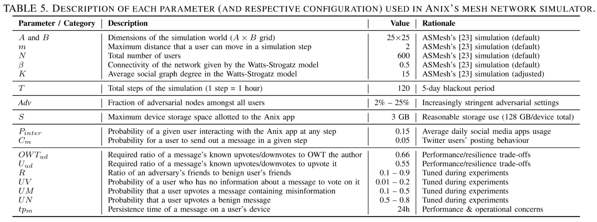

# MeshSim

A simulation framework for simulating mesh messaging systems. This repository holds the specific simulations for [Anix](https://cs.uwaterloo.ca/~s4kamali/paperfiles/kamali-sp25.pdf) and [Rangzen](https://arxiv.org/pdf/1612.03371). The features of this simulator include:

* capacity to simulate any mesh messaging system with any communication model
* easily tunable settings for every aspect of the simulation
* an in-memory data collector
* different awareness settings for users

Our next update will focus on having individual users with various awareness settings (as opposed to the whole population).

## How to use

First, install the requirements by running:

    pip install -r requirements.txt

Then, simply run the project by using:

    python main.py

## Parameters and how to tune them

All the tweak-able parameters of Anix are stored in the `settings.py` file. There you can find a short comment about what each parameter is, and how it will affect the code. There is also a full table about this available in the appendix of the Anix paper. Below, is a photo of said table.

